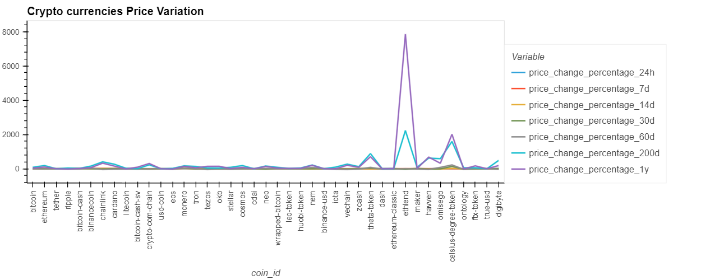
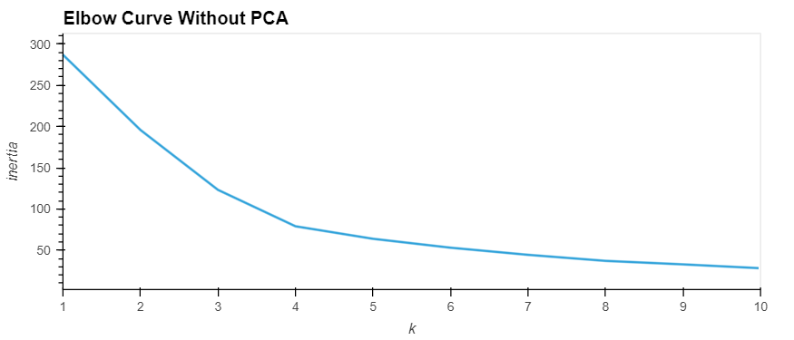
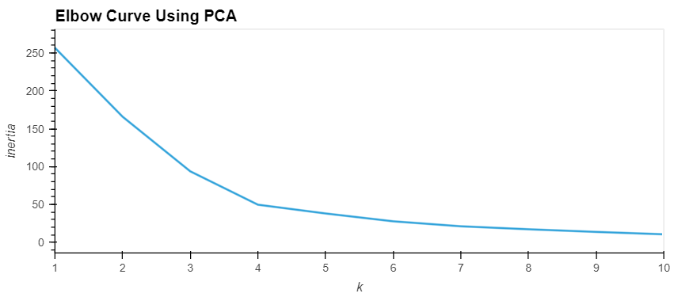
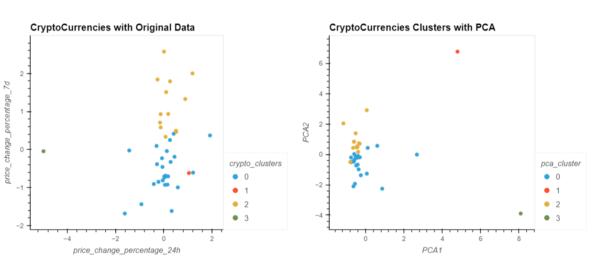

# Crypto Clustering

In this Jupyter notebook cryptocurrencies have been clustered by their performance in different time periods using unsupervises machine learning. The generated results are plotted to visually show the performance of clusters.

The steps for this challenge are broken out into the following sections:

* Import the Data (provided in the starter code)
* Prepare the Data (provided in the starter code)
* Find the Best Value for k Using the Original Data
* Cluster Cryptocurrencies with K-means Using the Original Data
* Optimize Clusters with Principal Component Analysis
* Find the Best Value for k Using the PCA Data
* Cluster the Cryptocurrencies with K-means Using the PCA Data
* Visualize and Compare the Results

Price variation of the crypto currencies provided in our original DataFrame is as below. 

To cluster the cryptos with KMeans model best value of k is derived using Elbow Method.  As can be seen in the below chart, Elbow method derived the best value for k as 4 under original data and PCA data.

|elbow_original                                         | elbow_PCA                            |
| -----------------------------------                   | ----------------------------------- |
|  |  |

With the best value for k found above by elbow method, the cryptos have been clustered according to their performance. After compeleting the requisite steps the clusters generated through original data and optimized through PCA are displayed below. 

As can be seen from the charts, the clusters generated through PCA resulted in better clustering. Since sum of explained variance ratio under PCA is 89.50% which makes the PCA data more ideal to draw a model. Additionally, from the chart, it appears that clusters generated through PCA resulted in better representation. Cluster  0 and cluster 2 are tightened up as compared to clusters derived from original data where data points are more random. 
 
 Looking at PCA clusters themselves reflected that clusters are more standarized but it is hard to make a true comparison between two charts since clusters derived from original data reflected only two dimensions "price change in 24 hrs" and "price change in 7days" whereas PCA chart reflected the dimensions which are most dominant in original data.Note that sum of expected variance ratio for PCA1 and PCA2 is approx. 72%.
  

